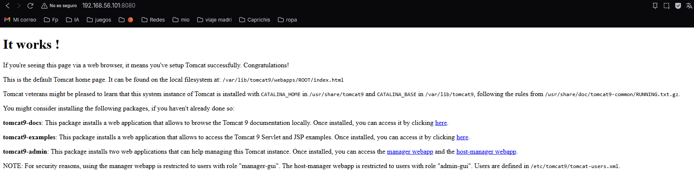
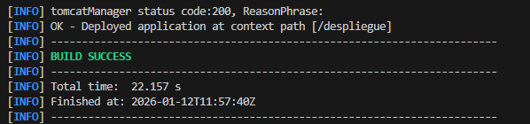

# Despliegue de Aplicaciones Java en Apache Tomcat con Maven

**Alumno:** Antonio Benitez Garcia
**Módulo:** Despliegue de Aplicaciones Web
**Curso:** 2025/2026

---

## 1. Introducción

En esta práctica se documenta el proceso completo de configuración de un servidor de aplicaciones Apache Tomcat sobre una máquina virtual Debian 11. El objetivo final es automatizar el despliegue de aplicaciones web Java utilizando Maven, realizándolo primero con una aplicación de prueba básica y finalmente con la aplicación "Rock-Paper-Scissors".

---

## 2. Preparación del Entorno (Java y Tomcat)

El primer paso para levantar el servidor es la instalación del Kit de Desarrollo de Java (OpenJDK), requisito indispensable para ejecutar Tomcat. Comprobamos la versión instalada para asegurar compatibilidad.

A continuación, instalamos el servidor de aplicaciones Tomcat 9 desde los repositorios oficiales de Debian.

Por motivos de seguridad y buenas prácticas, creamos un grupo y un usuario específico (`tomcat`) para la ejecución del servicio, evitando así usar el usuario root.

Una vez completada la instalación, verificamos que el servicio `tomcat9` se encuentra activo y en ejecución (`active/running`).

---

## 3. Configuración de Acceso Remoto

Por defecto, Tomcat bloquea el acceso a los paneles de administración desde fuera de `localhost`. Para permitir la gestión desde nuestra máquina anfitriona (Windows), editamos el archivo `context.xml` permitiendo el acceso a todas las IPs y reiniciamos el servicio.

Tras aplicar los cambios, comprobamos desde el navegador del anfitrión que podemos ver la página de bienvenida de Apache Tomcat ("It works!").

---

## 4. Gestión de Paneles de Administración

Para poder desplegar aplicaciones, necesitamos acceso a los gestores gráficos de Tomcat (`host-manager` y `manager`). Configuramos los usuarios y roles en el archivo `tomcat-users.xml` y accedemos a los paneles para verificar los permisos.

Acceso correcto al **Tomcat Virtual Host Manager**:

Detalle de la gestión de hosts virtuales:

Acceso al **Tomcat Web Application Manager**, donde gestionaremos las aplicaciones desplegadas:

---

## 5. Configuración de Maven y Despliegue de Prueba

Instalamos Apache Maven en la máquina virtual, herramienta que usaremos para la construcción y despliegue del software.

Para que Maven pueda comunicarse con Tomcat, configuramos las credenciales del servidor (usuario `alumno` y contraseña) en el archivo `settings.xml` (o en la configuración del servidor del plugin).

### Primer Despliegue: Aplicación "Hola Mundo"

Antes de pasar al juego, generamos una aplicación web básica de prueba (arquetipo `maven-archetype-webapp`) para verificar que el flujo de trabajo funciona.

Verificamos que la aplicación de prueba se despliega y es accesible desde el navegador mostrando el "Hello World!".

---

## 6. Despliegue Final: Rock-Paper-Scissors

Finalmente, procedemos con la tarea principal: el despliegue de la aplicación "Rock-Paper-Scissors".

1.  Clonamos el repositorio y cambiamos a la rama correcta.
2.  Configuramos el `pom.xml` con el plugin de Tomcat 7.
3.  Ejecutamos el comando de despliegue `mvn tomcat7:deploy`.

Como muestra la terminal, el proceso finalizó con éxito (**BUILD SUCCESS**).

Si volvemos al gestor de aplicaciones de Tomcat (Manager App), podemos confirmar que la aplicación `/juego` aparece listada y en estado `Running` (Verdadero).

### Resultado Final

Accedemos a la ruta desplegada (`/juego`) desde el navegador para confirmar que la aplicación funciona correctamente y podemos interactuar con ella.

