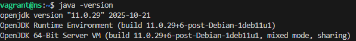
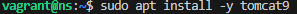
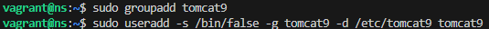
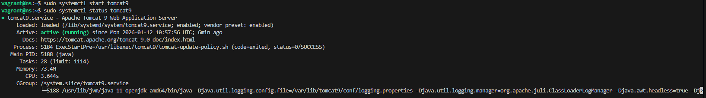
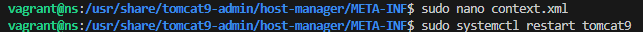
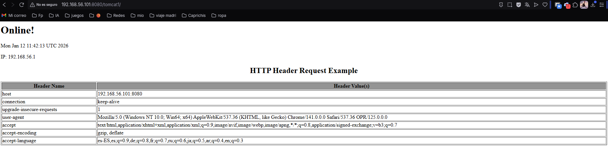
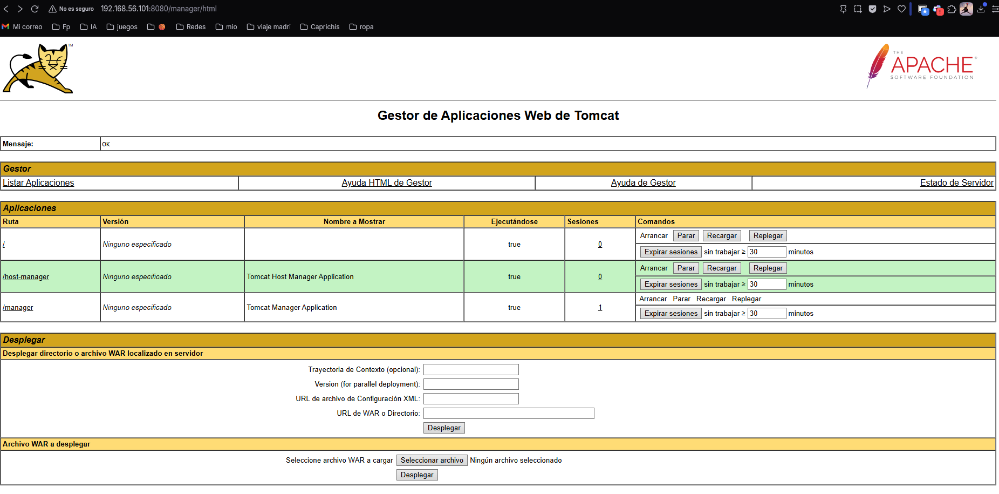
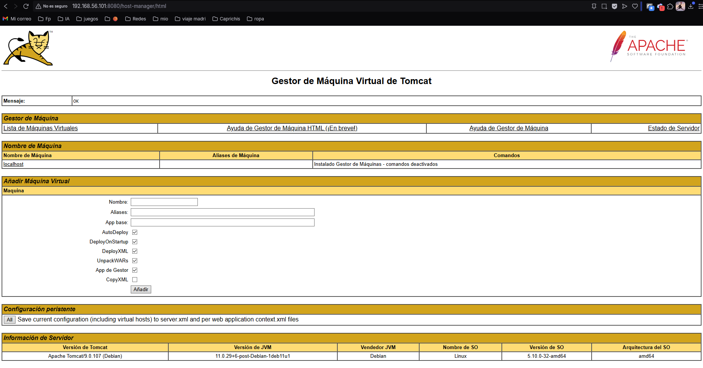
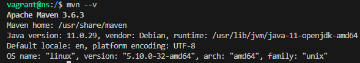
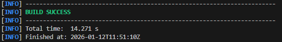

# Despliegue de Aplicaciones Java en Apache Tomcat con Maven

**Alumno:** Antonio Benitez Garcia
**Módulo:** Despliegue de Aplicaciones Web
**Curso:** 2023/2024

---

## 1. Introducción y Objetivos

El objetivo de esta práctica es configurar un entorno de servidor completo utilizando una máquina virtual Debian (gestionada mediante Vagrant). Sobre este sistema se instalará el servidor de aplicaciones Apache Tomcat y la herramienta de gestión de proyectos Maven.

La tarea final consiste en realizar el despliegue automatizado de una aplicación Java externa ("Rock-Paper-Scissors") desde el repositorio de código hasta el servidor en funcionamiento.

---

## 2. Preparación del Entorno: Instalaciones Básicas

El primer paso consiste en preparar la máquina virtual instalando el kit de desarrollo de Java (OpenJDK), requisito indispensable para ejecutar Tomcat.



A continuación, procedemos a la instalación del servidor de aplicaciones Tomcat 9 desde los repositorios oficiales.



Para garantizar la seguridad y una correcta gestión de permisos en el sistema Linux, se crea un grupo y un usuario específico para la ejecución del servicio Tomcat, evitando así ejecutarlo como root.



Una vez instalado, verificamos que el servicio se ha iniciado correctamente y está en estado `active (running)`.



---

## 3. Configuración de Acceso Remoto y Gestión

Por defecto, Tomcat restringe el acceso a la administración únicamente a `localhost`. Dado que trabajamos en una máquina virtual sin entorno gráfico, es necesario habilitar el acceso desde la máquina anfitriona.

Se modificó el archivo `context.xml` permitiendo conexiones desde IPs externas y se reinició el servicio para aplicar los cambios.



Comprobamos que ya tenemos acceso a la página de bienvenida de Tomcat desde el navegador del ordenador anfitrión.



### Configuración de Usuarios (Manager GUI)

Para acceder a los paneles de administración (`host-manager` y `manager-gui`), editamos el archivo `tomcat-users.xml` definiendo el usuario "alumno" y otorgándole los roles necesarios (`admin-gui`, `manager-gui`, `manager-script`, etc.).



Verificación de acceso al panel de administración de aplicaciones:



---

## 4. Instalación y Configuración de Maven

Maven es la herramienta que nos permitirá compilar y desplegar la aplicación de forma automatizada. Procedemos a su instalación en la máquina Debian.



Para comprobar que Maven interactúa correctamente con el sistema, generamos una estructura de aplicación básica de prueba.



---

## 5. Despliegue de la Aplicación "Rock-Paper-Scissors"

Esta es la tarea principal de la práctica. El proceso seguido fue:

1.  Clonado del repositorio desde GitHub.
2.  Cambio a la rama `patch-1`.
3.  Modificación del archivo `pom.xml` para incluir el plugin `tomcat7-maven-plugin`, configurando las credenciales y la ruta de despliegue.

Ejecución del comando de despliegue mediante Maven:

```bash
mvn tomcat7:deploy
